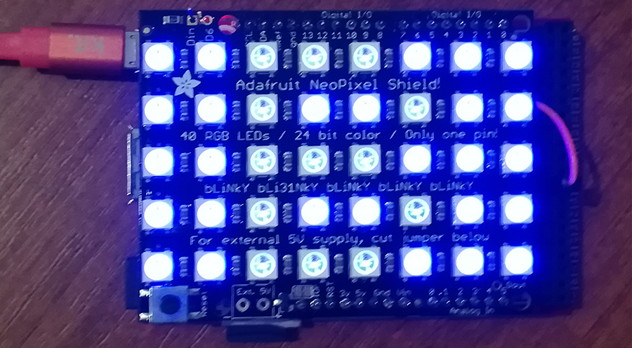

# NeoPixel modules
Version: __1.0.0__

## Connections ##
NeoPixel is connected as followed on [FEZ Panda III](https://old.ghielectronics.com/catalog/product/474):


<aside class="notice">
NeoPixel use specific timelapse to communicate, so we use SPI line to have high frequency (3.2 Mbps).
Pad between D6 and Din has been cut and Din is connected to D38.
</aside>


NeoPixel  | Mainboard
---------------- | ----------
5VDC              | 5V
GND              | GND
DIN              | MOSI (D38)

## Example of code:
```CSharp
using System.Threading;
using Bauland.Adafruit;
using GHIElectronics.TinyCLR.Pins;

namespace TestNeoPixel
{
    public class Color
    {
        public readonly byte Red;
        public readonly byte Green;
        public readonly byte Blue;

        public Color(byte r, byte g, byte b)
        {
            Red = r;
            Blue = b;
            Green = g;
        }
    }

    internal static class Program
    {
        static void Main()
        {
            byte intensity = 0x10;
            byte halfIntensity = (byte)(intensity / 2);
            byte quarterIntensity = (byte)(halfIntensity / 2);
            byte quarterHalfIntensity = (byte)(halfIntensity + quarterIntensity);

            int delay = 250;
            Color[] background =
            {
                new Color(0,intensity,0),
                new Color(0,quarterHalfIntensity,quarterIntensity),
                new Color(0,halfIntensity,halfIntensity),
                new Color(0,quarterIntensity,quarterHalfIntensity),
                new Color(0,0,intensity),
                new Color(quarterIntensity,0,quarterHalfIntensity),
                new Color(halfIntensity,0,halfIntensity),
                new Color(quarterHalfIntensity,0,quarterIntensity),
                new Color(intensity,0,0),
                new Color(quarterHalfIntensity,quarterIntensity,0),
                new Color(halfIntensity,halfIntensity,0),
                new Color(quarterIntensity,quarterHalfIntensity,0),
            };

            NeoPixel np = new NeoPixel(FEZPandaIII.SpiBus.Spi2, 40);
            while (true)
            {
                foreach (var color in background)
                {
                    np.ChangeAllColor(color.Red, color.Green, color.Blue);
                    Display(np, intensity, delay);
                }
            }
            // ReSharper disable once FunctionNeverReturns
        }

        private static void Display(NeoPixel np, byte intensity, int delay)
        {
            DisplayName(np, intensity);
            np.Show();
            Thread.Sleep(delay);
        }

        private static void DisplayName(NeoPixel np, byte intensity)
        {
            byte lowIntensity = (byte)(intensity / 2);
            int start = 2;
            int[] letterB = { 0, 1, 2, 8, 11, 16, 17, 18, 24, 27, 32, 33, 34 };
            foreach (var i in letterB)
            {
                np.ChangeColor(start + i, lowIntensity, lowIntensity, lowIntensity);
            }
        }
    }
}
```
