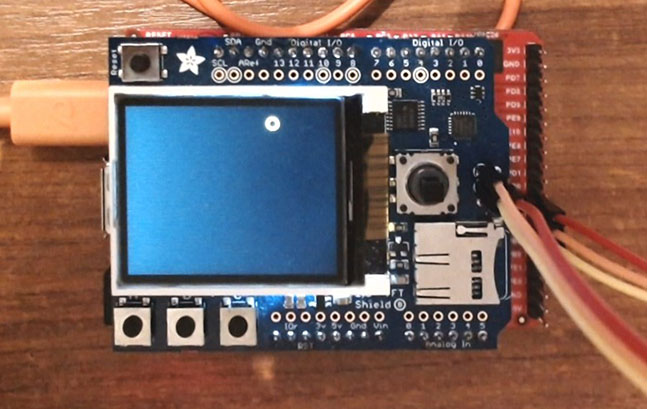

# TftDisplayShield modules
Version: __1.0.0__

<aside class="warning">
Must be used with at least 110kb of free ram to contain library.
</aside>

<aside class="notice">
SD card is not currently availabled as GHI library not allowed SPI connexions.
</aside>

## Connections ##
TftDisplayShield is connected as followed on [Fez Duino 3](https://docs.ghielectronics.com/hardware/sitcore/sbc.html#fez-duino):


<aside class="warning">
As mainboard don't have ICSP connection, three wires must be added as on picture.
</aside>


TftDisplayShield | Mainboard
---------------- | ---------
5VDC             | 5V
GND              | GND
I2C              | I2C
SPI              | SPI
TFT_DC           | D8   (PC5)
TFT_CS           | D10  (PB0)
MOSI (ICSP)      | MOSI (SPI3/PB5)
MISO (ICSP)      | MISO (SPI3/PB4)
SCLK (ICSP)      | SCLK (SPI3/PB3)


## Example of code:
```CSharp
using System;
using System.Diagnostics;
using System.Drawing;
using System.Threading;
using Bauland.Adafruit;
using GHIElectronics.TinyCLR.Native;
using GHIElectronics.TinyCLR.Pins;

namespace TestTftDisplayShield
{
    internal static class Program
    {
        private static TftDisplayShield _shield;
        static void Main()
        {
            try
            {
                _shield = new TftDisplayShield(STM32H7.I2cBus.I2c2, STM32H7.SpiBus.Spi3,
                    STM32H7.GpioPin.PB0, STM32H7.GpioPin.PC5);

                _shield.SetOrientation(Orientation.Landscape);
                _shield.SetBackLight(TftDisplayShield.BackLightOn);
                _shield.OnButtonPressed += _shield_OnButtonRaisedA;
                _shield.OnButtonReleased += _shield_OnButtonReleased;


                _shield.Screen.Clear();
                _shield.Screen.Flush();

                var width = _shield.Width;
                var height = _shield.Height;
                var color = new Pen(Color.Yellow);

                var rnd = new Random();
                var x = rnd.Next(width);
                var y = rnd.Next(height);
                var vx = rnd.Next(20) - 10;
                var vy = rnd.Next(20) - 10;

                DisplayMemoryUsage();
                while (true)
                {
                    _shield.ReadButtons();
                    x += vx;
                    y += vy;

                    if (x >= width || x < 0) vx *= -1;
                    if (y >= height || y < 0) vy *= -1;

                    _shield.Screen.Clear();
                    _shield.Screen.DrawEllipse(color, x, y, 10, 10);

                    _shield.Screen.Flush();

                    Thread.Sleep(10);
                }
            }
            catch (Exception ex)
            {
                Debug.WriteLine(ex.Message);
            }
        }

        private static void DisplayMemoryUsage()
        {
            Trace.WriteLine(
                            $"Free Ram/Used Ram/Total Ram: {Memory.ManagedMemory.FreeBytes} / {Memory.ManagedMemory.UsedBytes} / {Memory.ManagedMemory.UsedBytes + Memory.ManagedMemory.FreeBytes}");
        }

        private static void _shield_OnButtonReleased(TftDisplayShield sender, int buttonRaised)
        {
            Trace.WriteLine("Released: " + Button.ToString(buttonRaised));
        }

        private static void _shield_OnButtonRaisedA(TftDisplayShield sender, int buttonRaised)
        {
            Trace.WriteLine("Fired: " + Button.ToString(buttonRaised));
        }
    }
}
```
