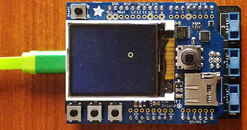

# TftDisplayShield modules
Version: __1.0.0__

<aside class="warning">
Must be used with at least 110kb of free ram to contain library.
</aside>

<aside class="notice">
SD card is not currently availabled as GHI library not allowed SPI connexions.
</aside>

## Connections ##
TftDisplayShield is connected as followed on [Netduino 3](https://www.wildernesslabs.co/netduino):



TftDisplayShield | Mainboard
---------------- | ---------
5VDC             | 5V
GND              | GND
I2C              | I2C
SPI              | SPI
TFT_DC           | D8
TFT_CS           | D10
MOSI (SPI2)      | MOSI
MISO (SPI2)      | MISO
SCLK (SPI2)      | SCLK


## Example of code:
```CSharp
using System;
using System.Diagnostics;
using System.Drawing;
using System.Threading;
using GHIElectronics.TinyCLR.Devices.Display;
using GHIElectronics.TinyCLR.Drawing;
using GHIElectronics.TinyCLR.Native;
using Bauland.Pins;

namespace FEZTftShieldDisplay
{
    static class Program
    {
        private static TftShieldDisplay _shield;

        static void Main()
        {
            try
            {
                _shield = new TftShieldDisplay(Netduino3.I2cBus.I2c, Netduino3.SpiBus.Spi2,
                    Netduino3.GpioPin.D10, Netduino3.GpioPin.D8);

                _shield.SetOrientation(TftShieldDisplay.Orientation.Portrait);
                _shield.GetDisplayControllerProvider.Enable();
                _shield.SetBackLight(TftShieldDisplay.BackLightOn);
                _shield.OnButtonRaised += _shield_OnButtonRaisedA;
                _shield.OnButtonReleased += _shield_OnButtonReleased;

                var disp = DisplayController.FromProvider(_shield.GetDisplayControllerProvider);
                disp.SetConfiguration(new SpiDisplayControllerSettings { Width = _shield.Width, Height = _shield.Height });

                var screen = Graphics.FromHdc(GraphicsManager.RegisterDrawTarget(new DrawTarget(disp)));
                screen.Clear(Color.Black);
                screen.Flush();

                var width = disp.ActiveConfiguration.Width;
                var height = disp.ActiveConfiguration.Height;
                var color = new Pen(Color.Yellow);

                var rnd = new Random();
                var x = rnd.Next(width);
                var y = rnd.Next(height);
                var vx = rnd.Next(20) - 10;
                var vy = rnd.Next(20) - 10;

                DisplayMemoryUsage();
                while (true)
                {
                    _shield.ReadButtons();
                    x += vx;
                    y += vy;

                    if (x >= width || x < 0) vx *= -1;
                    if (y >= height || y < 0) vy *= -1;

                    screen.Clear(Color.Black);
                    screen.DrawEllipse(color, x, y, 10, 10);

                    screen.Flush();

                    Thread.Sleep(10);
                }
            }
            catch (Exception ex)
            {
                Debug.WriteLine(ex.Message);
            }
        }

        private static void DisplayMemoryUsage()
        {
            Trace.WriteLine(
                            $"Free Ram/Used Ram/Total Ram: {Memory.FreeBytes} / {Memory.UsedBytes} / {Memory.UsedBytes + Memory.FreeBytes}");
        }

        private static void _shield_OnButtonReleased(TftShieldDisplay sender, int buttonRaised)
        {
            Debug.WriteLine("Released: " + TftShieldDisplay.Button.ToString(buttonRaised));
        }

        private static void _shield_OnButtonRaisedA(TftShieldDisplay sender, int buttonRaised)
        {
            Debug.WriteLine("Fired: " + TftShieldDisplay.Button.ToString(buttonRaised));
        }
    }
}
```
