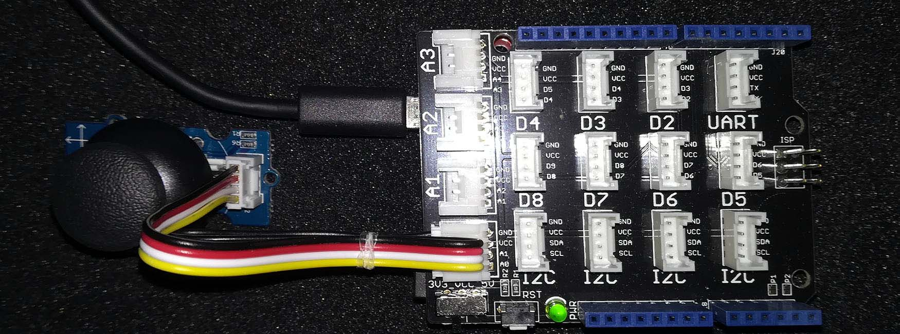

# Grove Thumb_Joystick modules
Version: __1.0.0-preview2__

## Connections ##
Grove Thumb_Joystick is connected as followed on [FEZ](https://www.ghielectronics.com/products/fez):



Grove Thumb_Joystick | Mainboard with base shield
---------------- | ----------
 Yellow wire | Socket A0
 White wire | Socket A1

## Example of code:
```CSharp
using System.Diagnostics;
using System.Threading;
using Bauland.Grove;
using GHIElectronics.TinyCLR.Pins;

namespace TestThumbJoystick
{
    internal static class Program
    {
        static void Main()
        {

            // Joystick connected on Socket A0 (so A0 and A1) of shield base on FEZ mainboard.
            // Make sure shield is 3V3 and not 5V to avoid overscale ADC.

            ThumbJoystick joystick = new ThumbJoystick(FEZ.AdcChannel.A0, FEZ.AdcChannel.A1);
            joystick.SetDeadZone(2050,2025,50);
            joystick.Click += Joystick_Click;
            joystick.Down += Joystick_Down;
            joystick.Up += Joystick_Up;
            joystick.Right += Joystick_Right;
            joystick.Left += Joystick_Left;

            while (true)
            {
                joystick.Read();
                Thread.Sleep(20);
            }
        }

        private static void Joystick_Left(ThumbJoystick joystick)
        {
            Debug.WriteLine($"Left: {joystick.X}");
        }

        private static void Joystick_Right(ThumbJoystick joystick)
        {
            Debug.WriteLine($"Right: {joystick.X}");
        }

        private static void Joystick_Up(ThumbJoystick joystick)
        {
            Debug.WriteLine($"Up: {joystick.Y}");
        }

        private static void Joystick_Down(ThumbJoystick joystick)
        {
            Debug.WriteLine($"Down: {joystick.Y}");
        }

        private static void Joystick_Click(ThumbJoystick joystick)
        {
            Debug.WriteLine($"Click: {joystick.IsPressed}");
        }
    }
}
```
