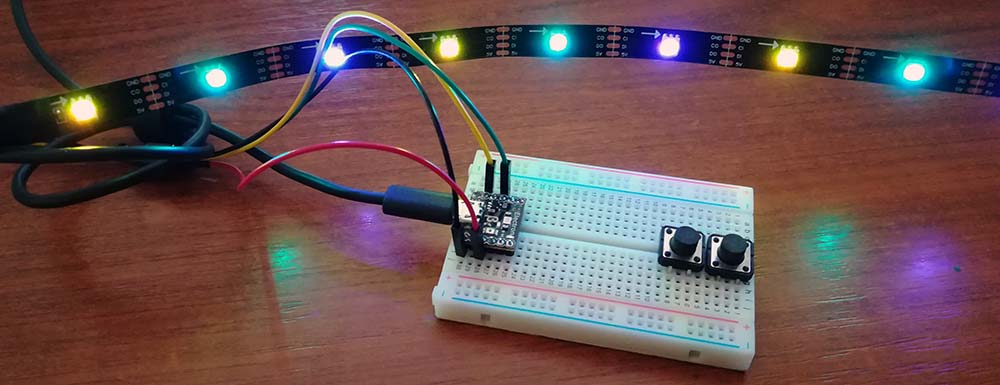

# LedStrip modules
Version: __1.0.0-preview3__

## Connections ##
LedStrip is connected as followed on [Electron](http://www.ingenuitymicro.com/products/electron/):



LedStrip | Mainboard
-------- | ----------
GND | GND
CI | CLK
DI | MISO
Vcc | 3.3V __(not working on 5V as 5V is in only !)__


## Example of code:
```CSharp
using System.Diagnostics;
using System.Runtime.InteropServices;
using System.Threading;
using Bauland.Pins;

namespace TinyCLRApplication2
{
    internal static class Program
    {
        private static LedStrip _ledStrip;
        static void Main()
        {
            if (Setup())
            {
                byte brightness = 0x03; // Between 0x00 and 0x1f because only 5bits
                int delayShort = 3;
                int delay = 100;
                _ledStrip.Clear();
                while (true)
                {
                    //for (int i = 0; i < 8; i++)
                    //    _ledStrip.TwinkleRandom(delay, brightness, 8);
                    //_ledStrip.RainbowWheel(delay, brightness);
                    _ledStrip.TheaterChase(delay, brightness, 0x7f, 0x0, 0x0, 10);
                    _ledStrip.FadeIn(delayShort, brightness, 255, 127, 0);
                    _ledStrip.FadeOut(delayShort, brightness, 255, 127, 0);
                    _ledStrip.Sparkle(delayShort, brightness, 255, 0, 0, 100);
                    _ledStrip.RunningLights(delay, brightness, 0xff, 0xff, 0xff);
                    _ledStrip.Wipe(delay, brightness, 0, 0x7f, 0);
                    _ledStrip.Wipe(delay, brightness, 0, 0x0, 0);
                    Thread.Sleep(20);
                }
            }
            else
            {
                Debug.WriteLine("Can't initialized - Bad board model");
            }
        }

        private static bool Setup()
        {
            Debug.WriteLine(DeviceInformation.DeviceName);
            switch (DeviceInformation.DeviceName)
            {
                case "Electron":
                    _ledStrip = new LedStrip(17, Electron11.SpiBus.Spi1, 16 + 8 /* Unconnected */, LedStrip.ColorOrder.Bgr);
                    return true;
                default:
                    return false;
            }
        }

    }
}
```
