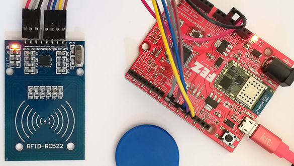

# Mfrc522 modules
Version: __1.0.1__

## Connections ##
Mfrc522 is connected as followed on [FEZ](https://www.ghielectronics.com/products/fez):



Mfrc522 | Mainboard
-------- | ----------
GND | GND
Vcc | 3.3V 
RST | 8
SDA | 9
SCK | 13
MISO | 12
MOSI | 11


## Example of code:
```CSharp
using System;
using System.Diagnostics;
using System.Threading;
using Bauland.Others;
using Bauland.Others.Constants.MfRc522;
using GHIElectronics.TinyCLR.Devices.Gpio;
using GHIElectronics.TinyCLR.Pins;

namespace testRC522
{
    static class Program
    {
        private static MfRc522 _mfRc522;
        static void Main()
        {
            Setup();
            Debug.WriteLine($"Version: 0x{_mfRc522.GetVersion():X}");
            InfiniteLoop();
        }

        private static void InfiniteLoop()
        {
            byte[] bufferAtqa = new byte[2];
            byte[] defaultKey = { 0xff, 0xff, 0xff, 0xff, 0xff, 0xff };

            while (true)
            {
                if (_mfRc522.IsNewCardPresent(bufferAtqa))
                {
                    Debug.WriteLine("Card detected...");
                    Debug.WriteLine($"ATQA: 0x{bufferAtqa[1]:X2},0x{bufferAtqa[0]:X2}");

                    var uid = _mfRc522.PiccReadCardSerial();
                    if (uid != null)
                    {
                        DisplayUid(uid);
                        try
                        {
                            byte pageOrSector = (byte)(uid.GetPiccType() == PiccType.Mifare1K ? 16 : 4);
                            for (byte i = 0; i < pageOrSector; i++)
                            {
                                Debug.WriteLine($"{i}:");
                                var buffer = _mfRc522.GetSector(uid, i, defaultKey /*, PiccCommand.AuthenticateKeyA*/);
                                if (uid.GetPiccType() == PiccType.Mifare1K)
                                {
                                    var c = _mfRc522.GetAccessRights(buffer);
                                    Display1kBuffer(buffer, c);
                                }
                                else if (uid.GetPiccType() == PiccType.MifareUltralight)
                                {
                                    DisplayUltralightBuffer(buffer);
                                }
                            }
                        }
                        catch (Exception ex)
                        {
                            Debug.WriteLine(ex.Message);
                        }

                        _mfRc522.Halt();
                        _mfRc522.StopCrypto();
                    }
                }

                Thread.Sleep(20);
            }
            // ReSharper disable once FunctionNeverReturns
        }

        private static void DisplayUltralightBuffer(byte[][] buffer)
        {
            for (int i = 0; i < buffer.Length; i++)
            {
                var line = "";
                for (int j = 0; j < buffer[i].Length; j++)
                {
                    line += $"{buffer[i][j]:X2} ";
                }
                Debug.WriteLine(line);
            }
        }

        private static void Display1kBuffer(byte[][] buffer, byte[] accessRights)
        {
            for (int i = 0; i < buffer.Length; i++)
            {
                var line = "";
                for (int j = 0; j < buffer[i].Length; j++)
                {
                    line += $"{buffer[i][j]:X2} ";
                }
                line += $"[{(accessRights[0] >> i) & 0x01} {(accessRights[1] >> i) & 0x01} {(accessRights[2] >> i) & 0x01}]";
                Debug.WriteLine(line);
            }
        }

        private static void DisplayUid(Uid uid)
        {
            string msg = "Uid of card is: ";
            for (int i = 0; i < (int)uid.UidType; i++)
            {
                msg += $"{uid.UidBytes[i]:X2} ";
            }
            msg += $"SAK: {uid.Sak:X2}";
            Debug.WriteLine(msg);
            switch (uid.GetPiccType())
            {
                case PiccType.Mifare1K:
                    Debug.WriteLine("PICC type: MIFARE 1K");
                    break;
                case PiccType.MifareUltralight:
                    Debug.WriteLine("PICC type: MIFARE Ultralight");
                    break;
                default:
                    Debug.WriteLine("PICC type: Unknown");
                    break;
            }
        }

        private static void Setup()
        {

            _mfRc522 = new MfRc522(FEZ.SpiBus.Spi1, FEZ.GpioPin.D8, FEZ.GpioPin.D9);
        }
    }
}
```
